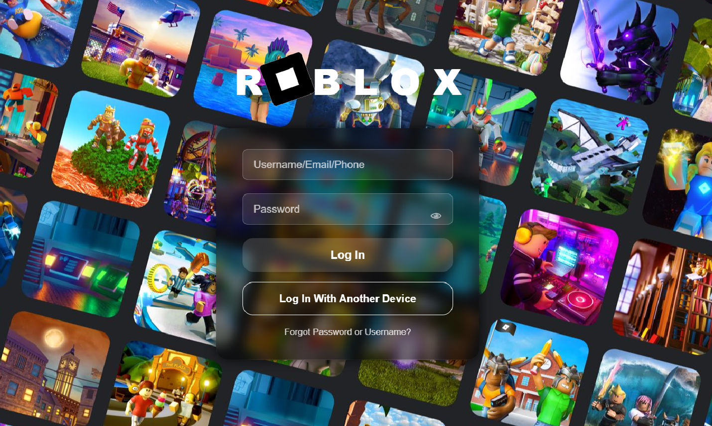

<h1>🧩 Roblox Login Page (UI Clone)</h1>
<h2>🎯 Project Overview</h2>

This project is a front-end replica of the Roblox login page, built using HTML, Tailwind CSS, and JavaScript.
It’s designed for educational purposes — showcasing responsive design, styled form inputs, and basic UI interactivity like password visibility toggling.

<h2>Website Overview</h2>

  

<h2>🛠️ Features</h2>

🎨 Modern and responsive UI using Tailwind CSS

🔒 Password visibility toggle

🧱 Form validation and smooth interaction

🖼️ Background image overlay with blur effects

💬 “Done” message after simulated submission

🧰 Technologies Used

HTML5 – Structure and semantic layout

Tailwind CSS – Responsive and modern styling

JavaScript (Vanilla) – Form interactivity and event handling
